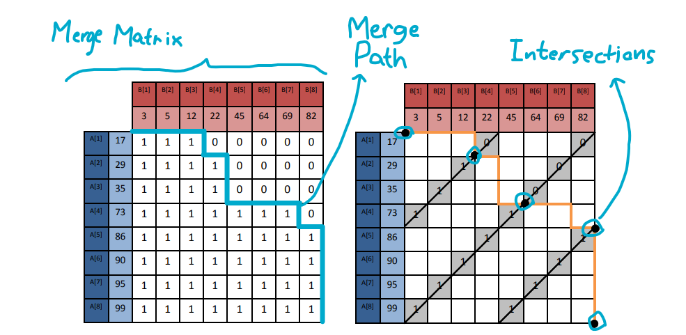
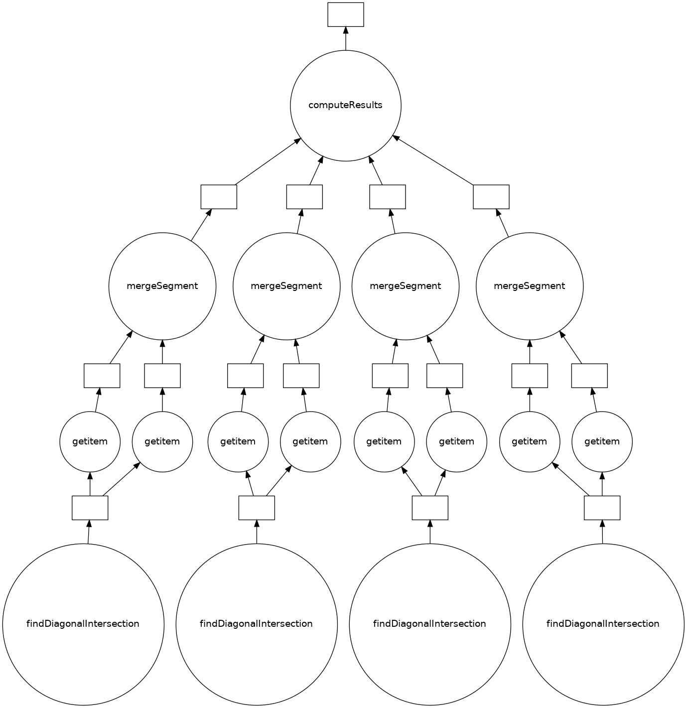

Distributed programming project for the Advanced Parallel Systems course at Grenoble INP - Ensimag 

# Merge Path
Python implementation using the [`dask`](https://www.dask.org/) library for parallelization.

The goal of the project is to compare the performance of parallel merging with sequential merging in the merge sort algorithm.

## Reference Paper
📄[Merge Path - A Visually Intuitive Approach to Parallel Merging](https://arxiv.org/pdf/1406.2628.pdf)

👨‍🔬Oded Green 🧑‍🔬Saher Odehb 👨‍🔬Yitzhak Birk

### *Abstract*
> Merging two sorted arrays is a prominent building block for sorting and other functions.
Its efficient parallelization requires balancing the load among compute cores, minimizing the
extra work brought about by parallelization, and minimizing inter-thread synchronization
requirements. Efficient use of memory is also important.
>
> We present a novel, visually intuitive approach to partitioning two input sorted arrays
into pairs of contiguous sequences of elements, one from each array, such that 1) each pair
comprises any desired total number of elements, and 2) the elements of each pair form a
contiguous sequence in the output merged sorted array. While the resulting partition and the
computational complexity are similar to those of certain previous algorithms, our approach
is different, extremely intuitive, and offers interesting insights. Based on this, we present a
synchronization-free, cache-efficient merging (and sorting) algorithm.
>
> While we use a shared memory architecture as the basis, our algorithm is easily adaptable
to additional architectures. In fact, our approach is even relevant to cache-efficient sequential
sorting. The algorithms are presented, along with important cache-related insights.

## Work Report

To start out having a base of comparison, I gathered a merge sort implementation online so I could compare the two alternatives of merging arrays. Then, I modified it so it could receive the merge function as a parameter, removing the need of a second merge sort function for the parallel merge.

Proceding to the parallel merge implementation, I needed to get down the core concepts of the paper's work:

- The merge matrix

When merging to arrays `A` and `B`, the *merge matrix* is a representation of the element of the two arrays, where each row represents an element of `A` and each column represents an element of `B`. The element $M_{ij}$ in the matrix is the numerical representation of $A_i \gt B_j$. 
- The merge path

The series of choices between elements of `A` and `B` when sequentially merging the two arrays are represented by the *merge path*. It can also be seen as the line above the 1s and below the 0s of the matrix. 
- The cross-diagonal intersections

Different from the other two, the importance of this concept to the algorithm is not obvious. Finding the intersection of the $i$ th cross-diagonal of the matrix with the merge path is the same of finding the point where the merge path will be after $i$ steps of merging `A` and `B`, as stated in `Lemma 8`. Maybe a more intuitive way of understanding this is thinking that the goal is to find how many elements of `A` and `B` have already been used after $i$ steps.

Although these three concepts are not explained right away in the paper, there are a series of propositions that lead up to them. Those propositions are used to prove the correctness of the work division in the merge algorithm with theorems and lemmas.

In practice, neither the merge path nor matrix are going to be actually computed on the parallel merge. Instead, they are used as guidelines to achieve middle steps of the solution without going through the previous steps first. This way, we can set a starting point and a lenght to each of the threads and run then in parallel to end up with the merged array.

Getting back to implementation, The algorithm is broken down in two parts: the main function that divides the work between the threads and the helper function to calculate the intersections. After translating the pseudocode to Python and trying to make sense out of the name of the variables they used, I stepped back and wrote the code again from scratch by organizing the code according to the expected behavior instead of mimicking the pseudocode from the paper.

The idea of the main function is diving the work in $p$ threads:
- Divide the length of the result array by $p$ to find the segment length
- Calculate the starting point on the result array -> i * segment length 
- Find the intersection on the starting point
- Merge sequentially $segment Length$ elements into the result from starting point

Now, for the intersection calculation, the pseudocode does a really bad job at showing it, but it's just making a binary search in the diagonal to find the point between a 1 and a 0, or above all 1s or below all zeros for the edge cases where there is only one type of them.

After being done with the implementation, I had to use Dask to make the execution parallelizable, which was more or less straighforward. The main function just makes delayed calls for the intersection finding and merge functions. The only problem was that the merge function had no return value, and the $p$ different calls to this function were independent from each other. The solution for this was retrieving the *Delayed* object from the function call and yielding it into an array that later could be passed as parameter to `dask.compute` in order to run the tasks in parallel. The task graph for one run of the main function is represented by the image below.

I made aliases to the functions to make it more readable on the image, and also artificially joined the four thread executions with the dummy function `computeResults`. The result from `findIntersection` is a tuple of two int values that are used as arguments for `mergeSegment` separately, thus the need of the built-in `getitem` nodes.

Finally, in terms of performance, the parallel version ended up being slower than the sequential one, perhaps due to the excessive layers of objects and function calls (which Python does not like much), and even maybe extra implicit copying of the arrays. A future improvement of my implementation could be adapting the cache awareness part from the paper into my code, indicating that cache misses were a big player in the performance.

Mergesort times:
| Input size | Sequential Runtime | Parallel Runtime | 
| - | - | - |
| 1K | 2ms | 2ms |
| 10K | 31ms | 409ms |
| 100K | 384ms | 6.61s |
| 1M | 4.89s | 116.8s |
